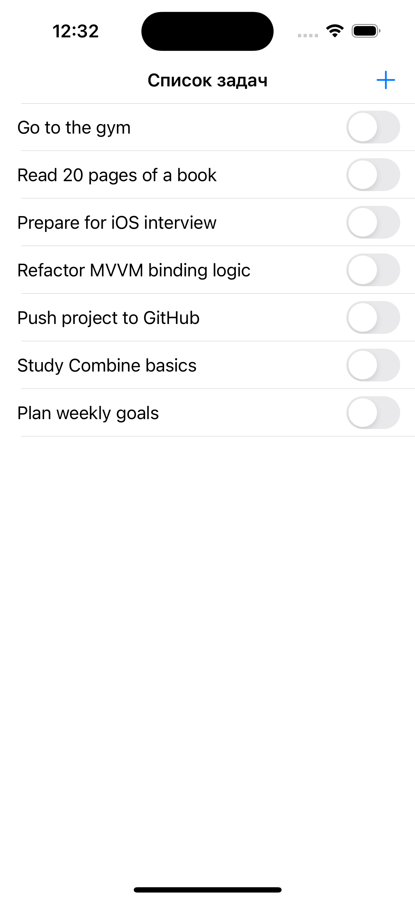
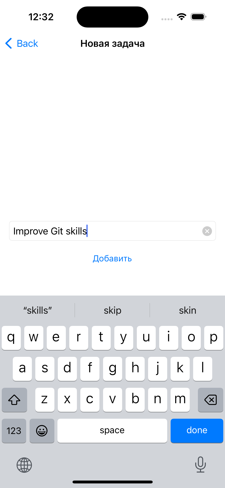
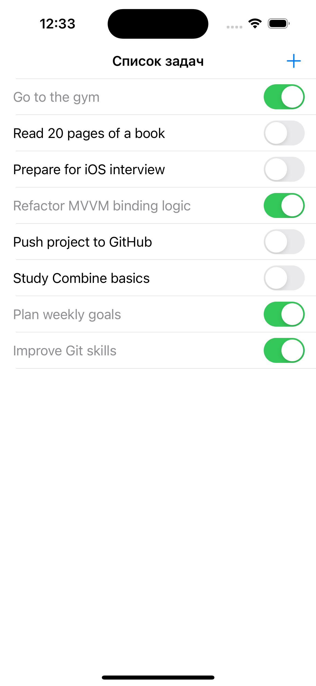

# ToDo List (MVVM)

Simple ToDo List iOS app built with MVVM architecture and local persistence.

## Features
- Add / delete tasks
- Mark task as done
- Local storage (UserDefaults)
- MVVM separation (View / ViewModel / Model)

## Tech Stack
- Swift
- UIKit
- MVVM
- UserDefaults
- Codable

## Screenshots

### Task List
Displays all created tasks with completion toggle.

---

### Add Task
Screen for creating a new task.

---

### Completed Task
Example of a completed task state.

